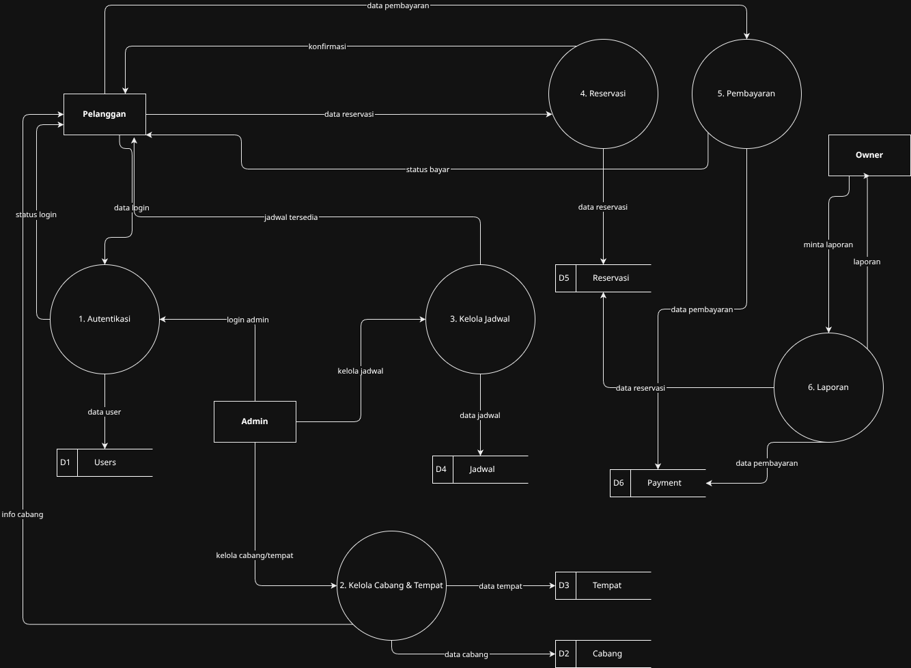
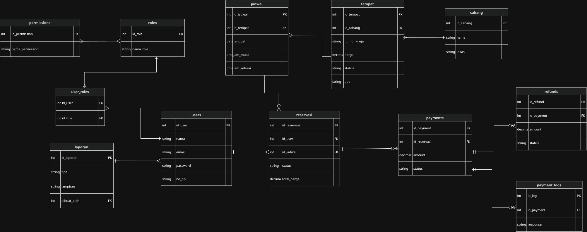
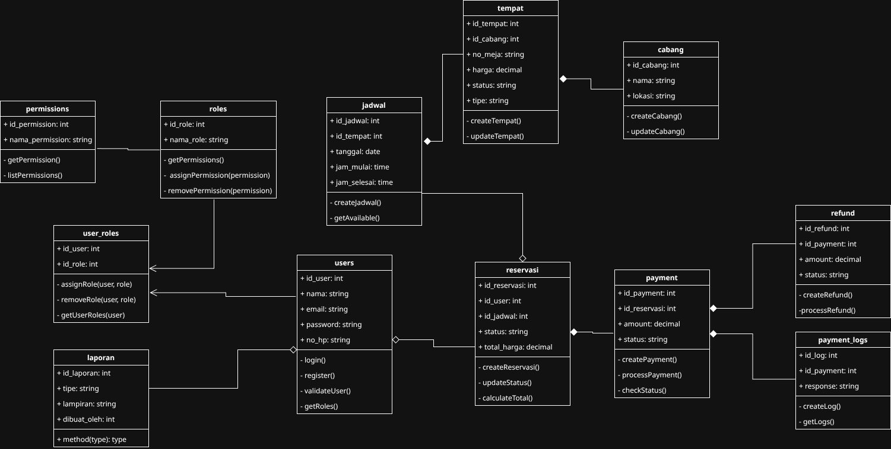
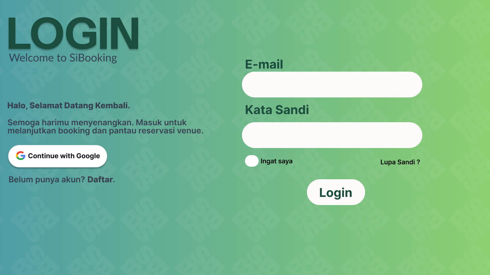
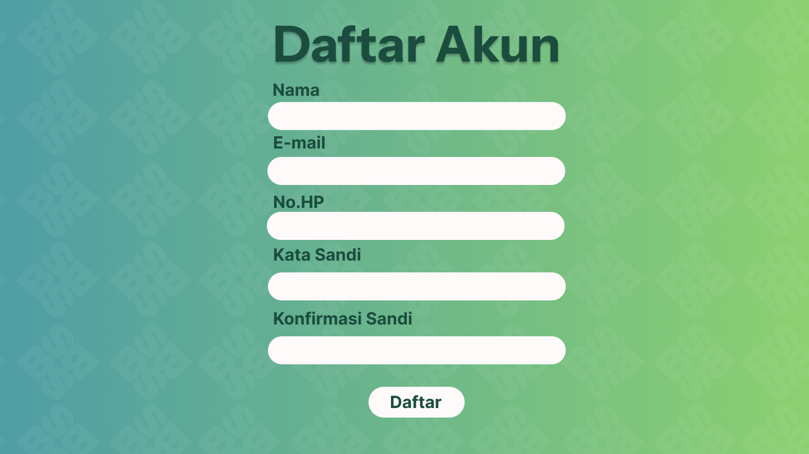
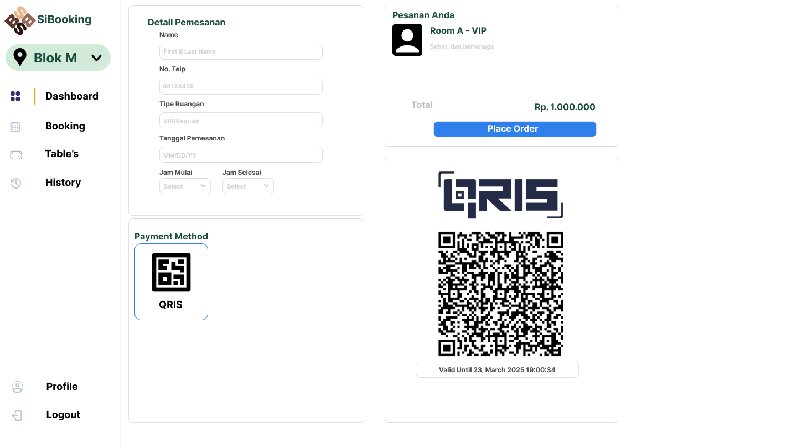
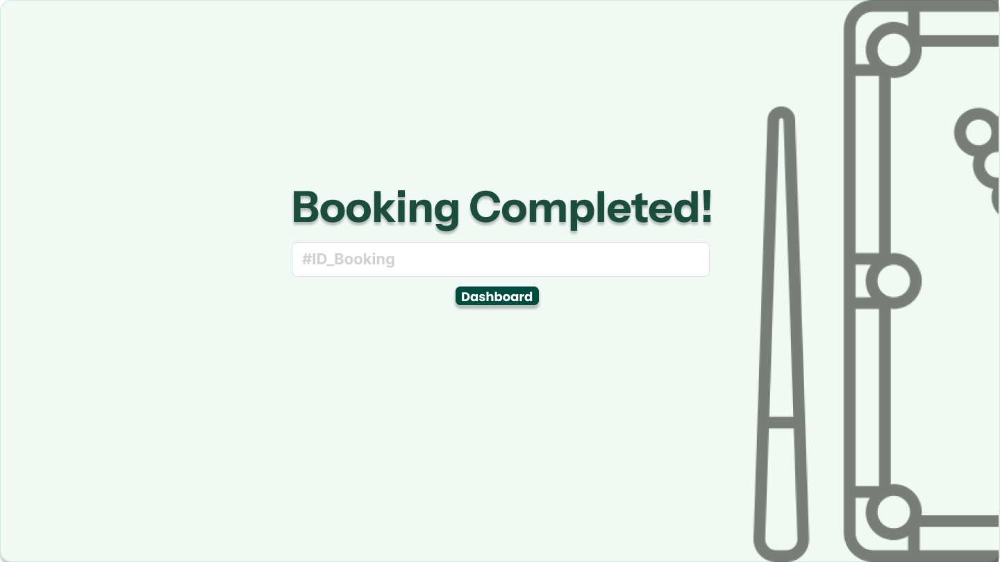
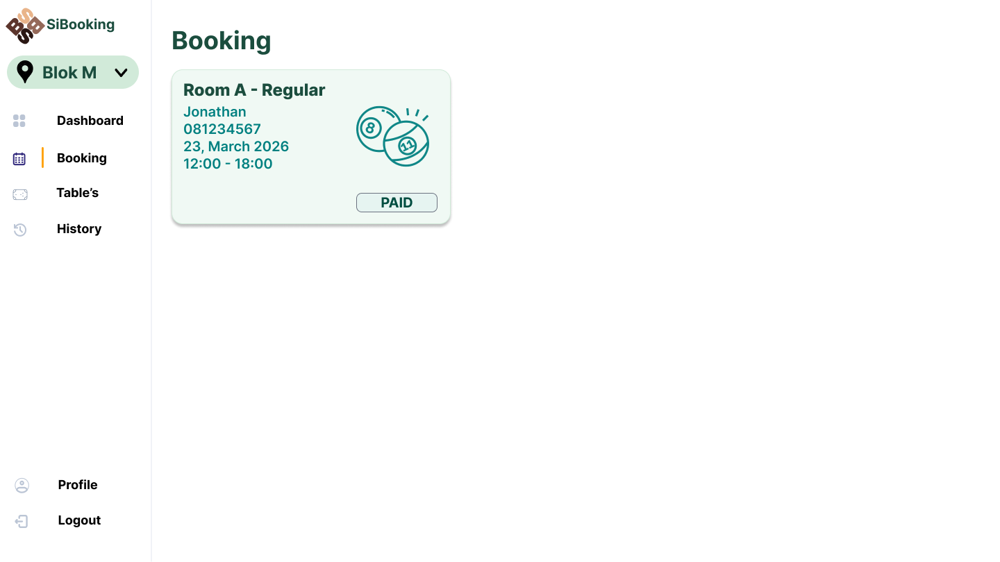
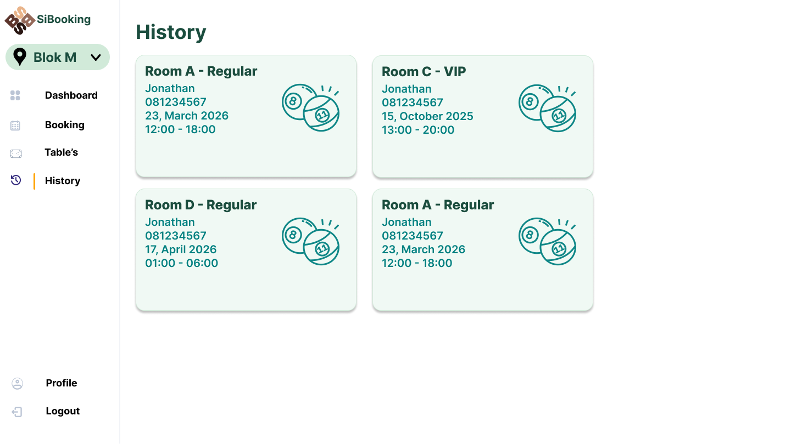

Markdown
# 🚀 Tugas Besar: SiBooking - Web reservasi meja Billiard

> **Dosen Pengampu:** Muhammad Shiddiq Azis, S.T., MBA

---

## 📊 Perancangan Sistem (DFD)

### DFD Level 0

*Diagram Konteks yang menunjukkan aliran data global.*

### DFD Level 1

*Detail proses bisnis dan integrasi database.*

### ERD

*Rancangan Database.*

### Class Diagram

*Detail Behavior setiap kelas.*
---

## 🎨 Mockup Antarmuka
Rancangan UI aplikasi yang berfokus pada pengalaman pengguna.

| Login Page | Register Page | Dashboard Admin |
| :---: | :---: | :---: |
|  |  |  |
| Dashboard User | Payment Page | Booking completed |
| :---: | :---: | :---: |
|  |  |  |
| Status Booking | History |
| :---: | :---: | :---: |
|  |  |
---

## 🛠️ Stack Teknologi
- **Frontend:** Next.js
- **Backend:** Fast API 
- **Database:** PostgreSQL

---

## 📂 Cara Instalasi
1. `git clone https://github.com/amdqeis/IMPAL`
2. `cd frontend`
3. `npm install`
4. `npm run dev`
5. `cd backend`
6. `python -m venv venv`
7. `source venv/bin/activate`  # Linux / Mac
8. `venv\Scripts\activate`     # Windows
9. `pip install -r requirements.txt`
10. `uvicorn main:app --reload`

