Markdown
# 🚀 Tugas Besar: SiBooking - Web reservasi meja Billiard

> **Dosen Pengampu:** Muhammad Shiddiq Azis, S.T., MBA

---

## 📊 Perancangan Sistem (DFD)

### DFD Level 0
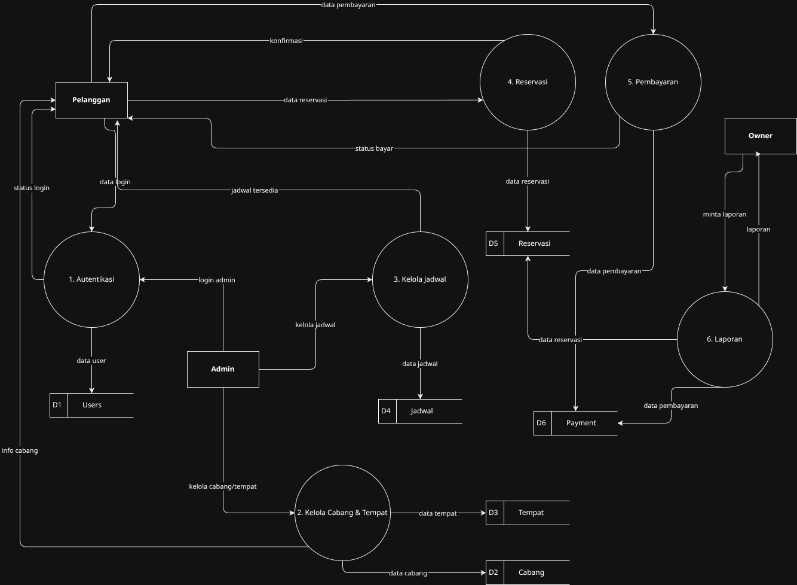
*Diagram Konteks yang menunjukkan aliran data global.*

### DFD Level 1
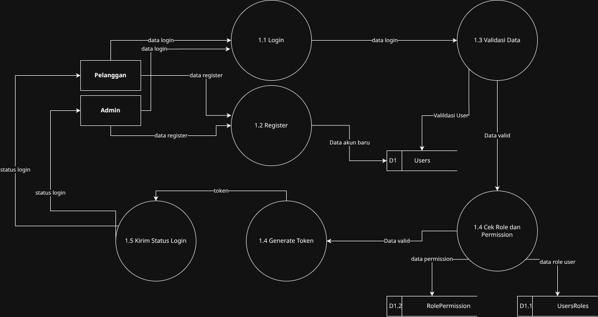
*Detail proses bisnis dan integrasi database.*

### ERD
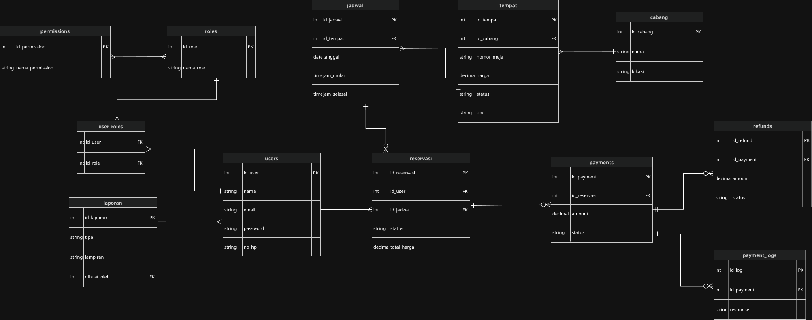
*Rancangan Database.*

### Class Diagram
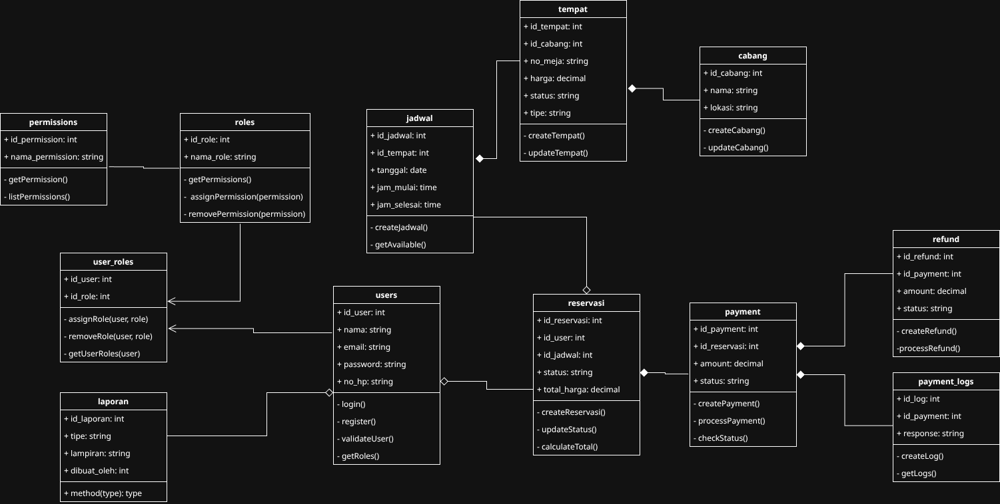
*Detail Behavior setiap kelas.*
---

## 🎨 Mockup Antarmuka
Rancangan UI aplikasi yang berfokus pada pengalaman pengguna.

| Login Page | Register Page | Dashboard Admin |
| :---: | :---: | :---: |
| 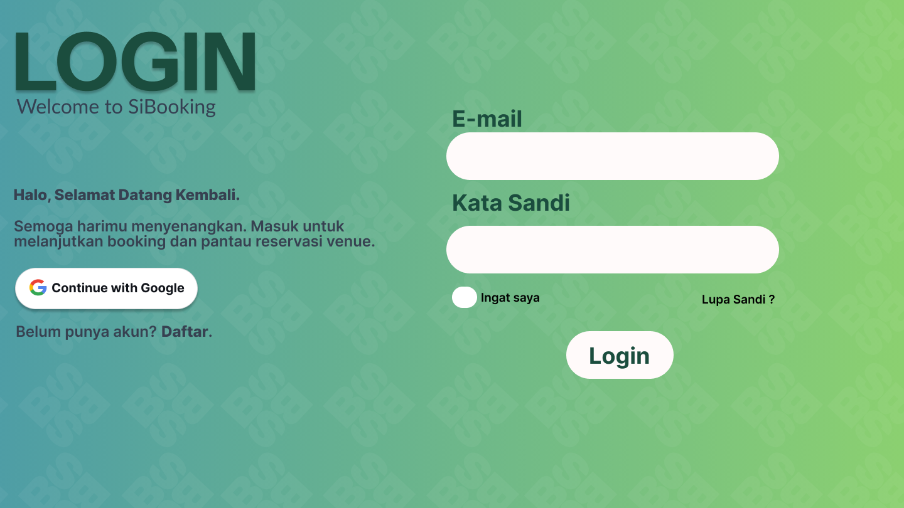 | 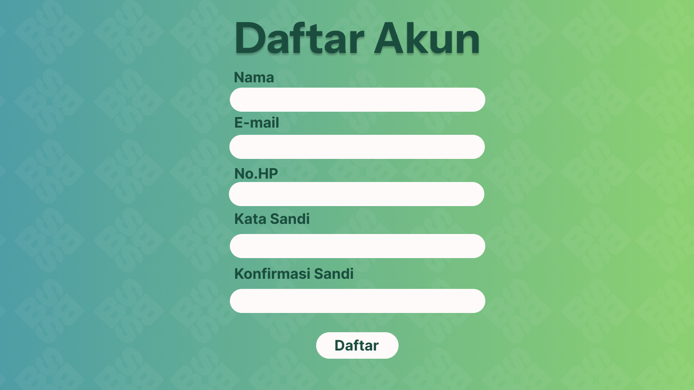 | 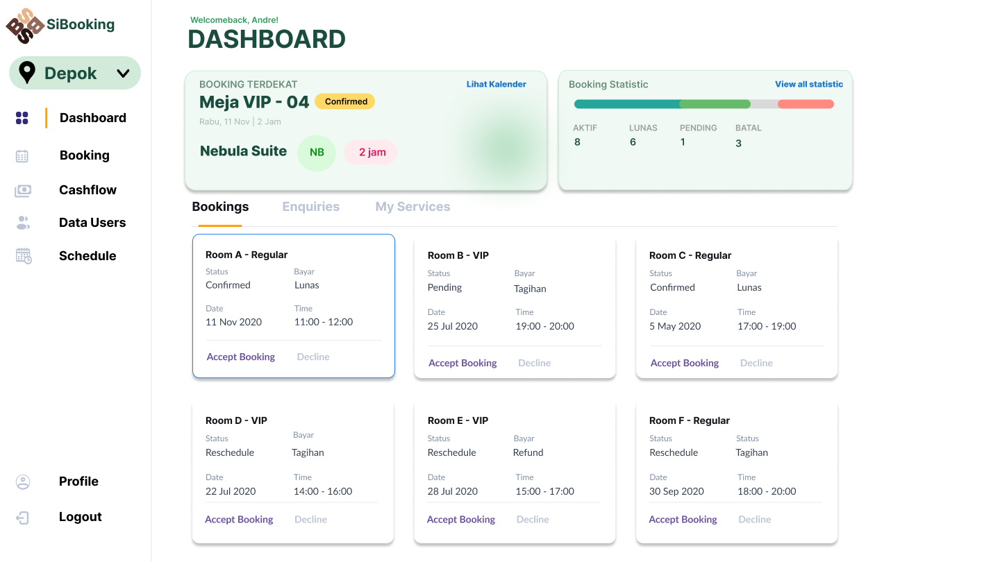 |
| Dashboard User | Payment Page | Booking completed |
| :---: | :---: | :---: |
| 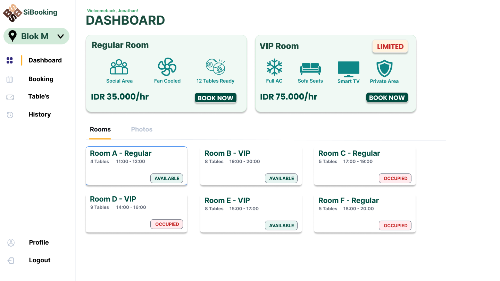 | 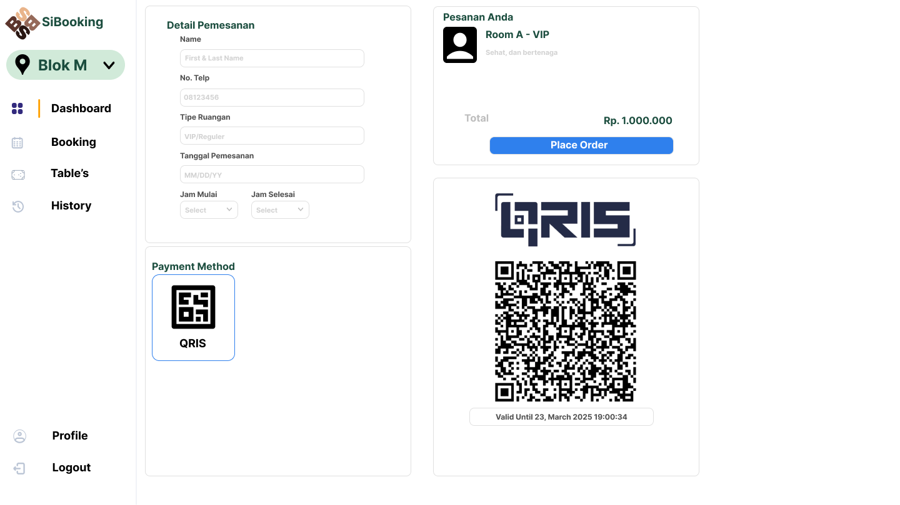 | 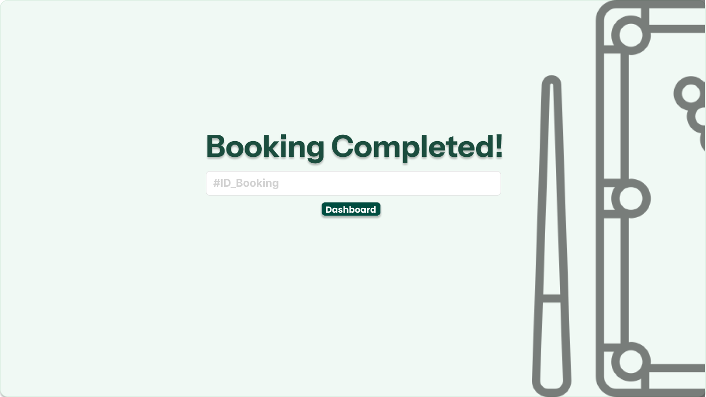 |
| Status Booking | History |
| :---: | :---: | :---: |
| 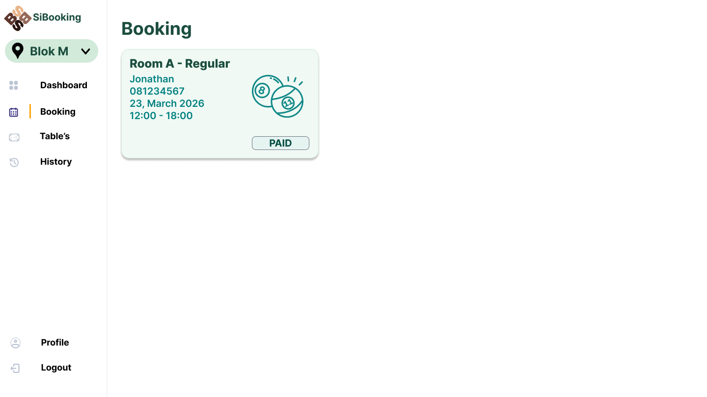 | 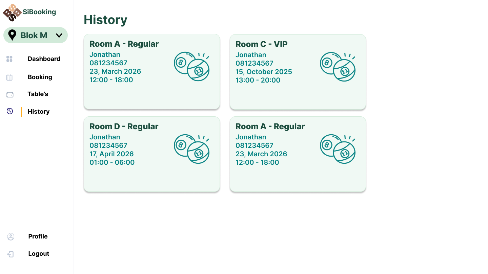 |
---

## 🛠️ Stack Teknologi
- **Frontend:** Next.js
- **Backend:** Fast API 
- **Database:** PostgreSQL
- **Deployment:** Virtual Private Server (VPS)
- **Access Token:** JWT
- **Middleware:** Nginx/PM2
---

## 📂 Cara Instalasi
### 1. Clone Repository
```bash
git clone https://github.com/amdqeis/IMPAL
cd IMPAL
```
### 2. Frontend
```bash
# Masuk ke Folder Frontend
cd frontend
# Install Dependencies
npm install
# Jalankan Frontend
npm run dev
```
Secara default, frontend akan berjalan pada:
```bash
http://localhost:3000
```
### 3. Backend
Masuk ke Folder Backend
Buka terminal baru, lalu masuk ke folder backend:
```bash
cd backend
#Buat Virtual Environment
python -m venv venv
```
Aktifkan Virtual Environment
Linux / Mac
```bash
source venv/bin/activate
```
Windows
```bash
venv\Scripts\activate
```
Install Dependencies Backend
```bash
pip install -r requirements.txt
```
Jalankan Backend
```bash
uvicorn main:app --reload
```
Backend akan berjalan pada:
```bash
http://localhost:8000
```
Dokumentasi API dapat diakses melalui Swagger pada:
```bash
http://localhost:8000/docs
```
### 4. Database
Buat File Environment
Sebelum menjalankan database, buat dan isi file berikut:
```bash
backend/.env
```
Contoh isi file .env:
```bash
APP_NAME=IMPAL Backend
APP_ENV=development
APP_DEBUG=true

SECRET_KEY=your_secret_key
SESSION_COOKIE_NAME=your_session_cookie_name

FRONTEND_URL=http://localhost:3000

DATABASE_URL=your_database_url
```
Inisialisasi Database
Setelah konfigurasi .env selesai, jalankan script berikut untuk membuat table:
```bash
python app/db/init_db.py
```
Isi Dummy Data
Jika ingin menambahkan data dummy, jalankan:
```bash
python app/db/seed_dummy_data.py
```
