Markdown
# 🚀 Tugas Besar: SiBooking - Web reservasi meja Billiard

> **Dosen Pengampu:** Muhammad Shiddiq Azis, S.T., MBA

---
## 🌐 Akses Website

Aplikasi SiBooking sudah dapat diakses secara online melalui alamat berikut:

**Website:**  
https://sibooking.keispace.cloud

**API Documentation / Swagger:**  
https://sibooking.keispace.cloud/docs

## 📊 Perancangan Sistem (DFD)

### DFD Level 0

*Diagram Konteks yang menunjukkan aliran data global.*

### DFD Level 1
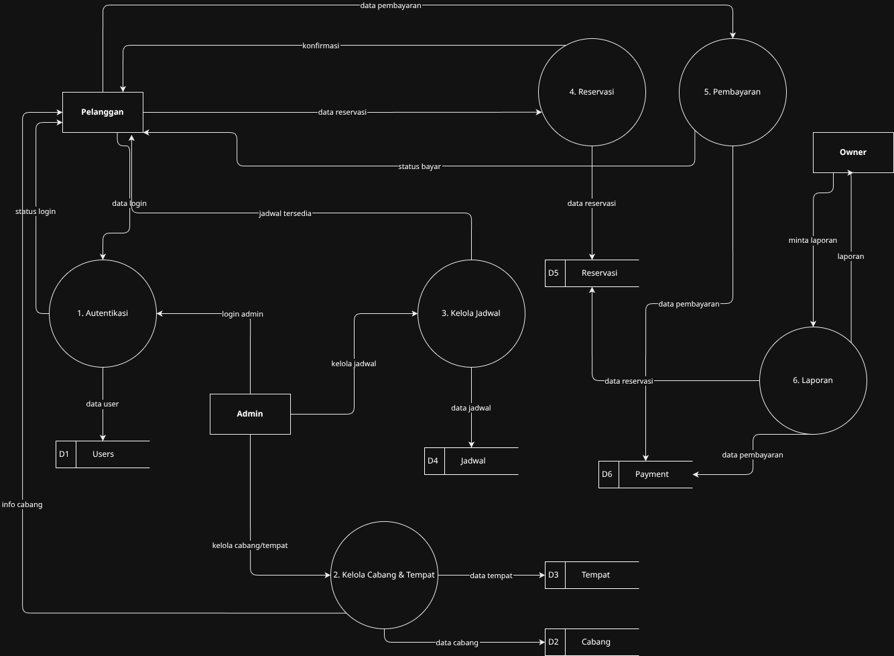
*Detail proses bisnis dan integrasi database.*

### ERD

*Rancangan Database.*

### Class Diagram
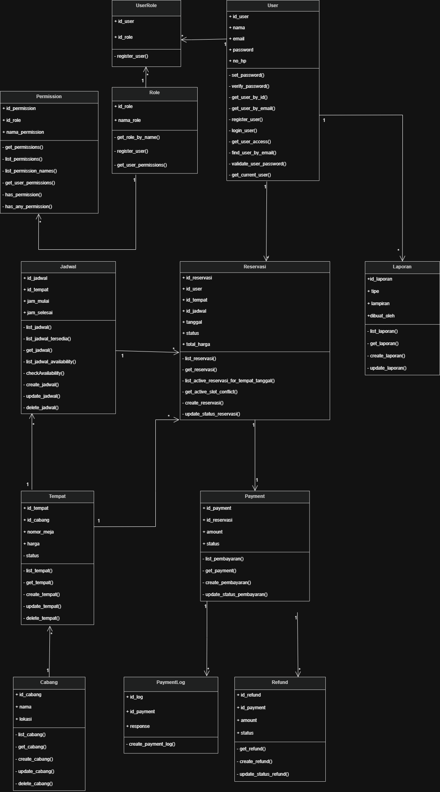
*Detail Behavior setiap kelas.*
---

## 🎨 Mockup Antarmuka
Rancangan UI aplikasi yang berfokus pada pengalaman pengguna.

| Booking Admin | Booking User | Booking Completed |
| :---: | :---: | :---: |
| 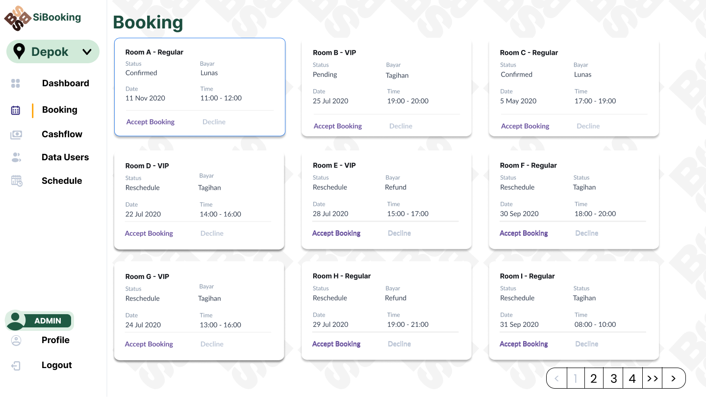 | 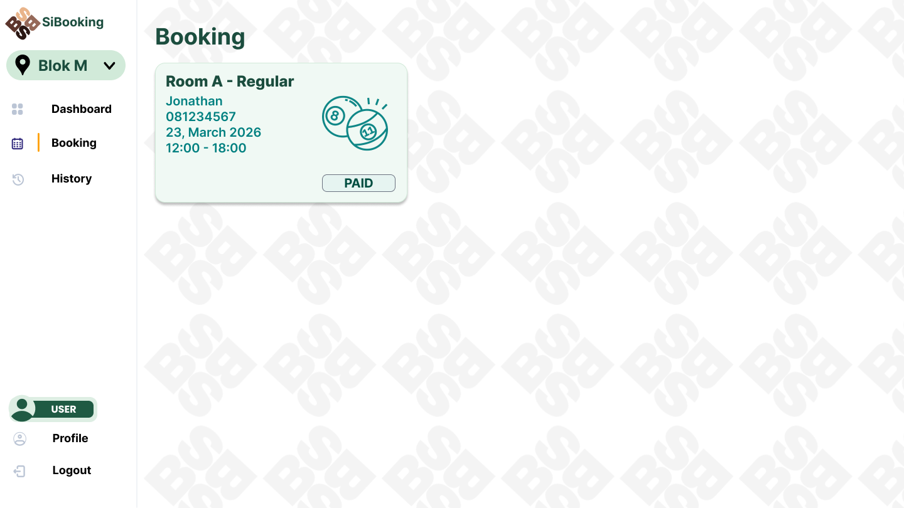 |  |
| Cashflow | Daftar Akun | Dashboard Admin |
| :---: | :---: | :---: |
| 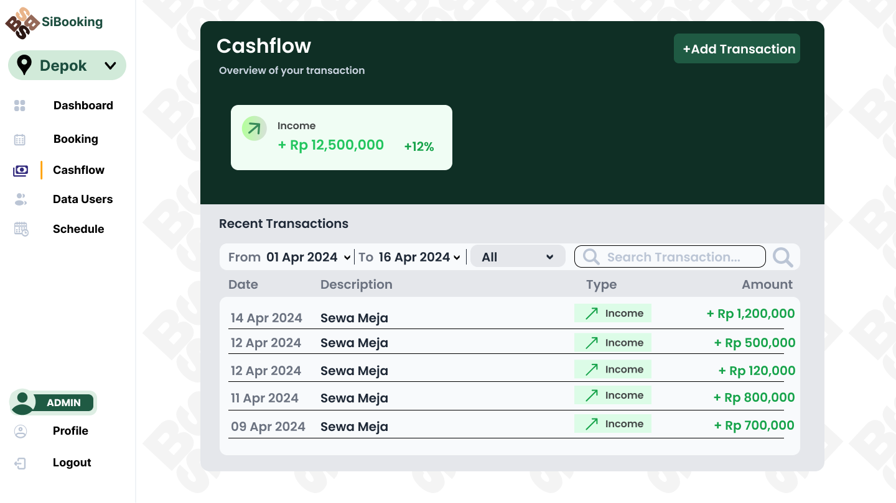 |  | 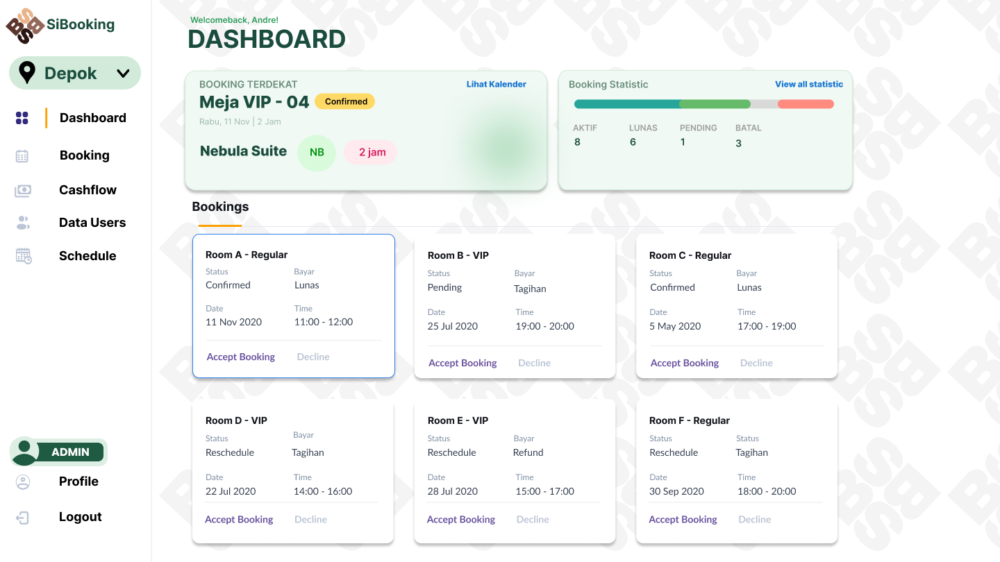 |
| Dashboard User | Data Users | History User |
| :---: | :---: | :---: |
| 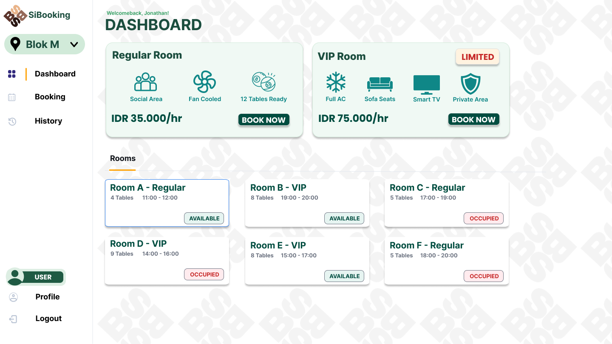 | 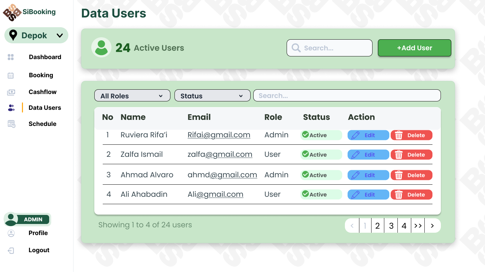 | 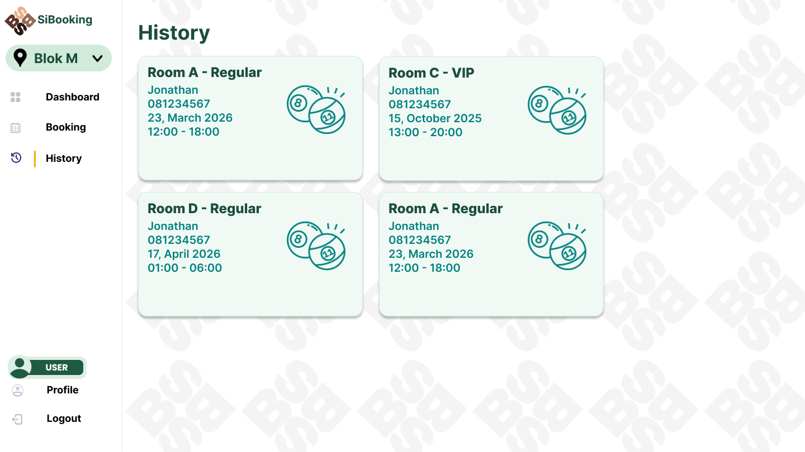 |
| Login Page Admin | Login Page User | Payment Page |
| :---: | :---: | :---: |
| .png) | .png) | 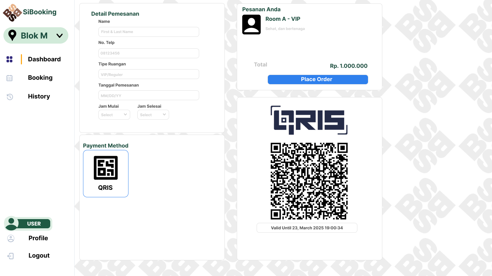 |
| Payment | Profile Page Admin | Profile Page User |
| :---: | :---: | :---: |
| 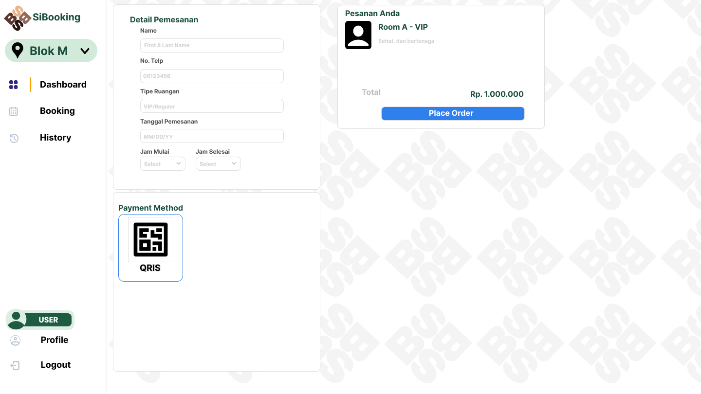 | .png) | .png) |
| Schedule |  |  |
| :---: | :---: | :---: |
| 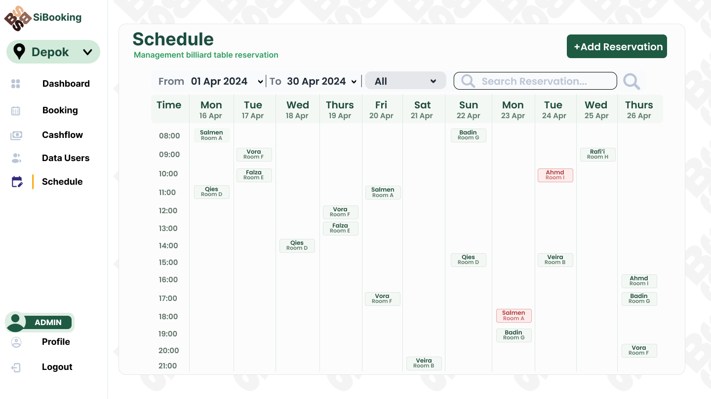 |  |  |
---

## 🛠️ Stack Teknologi
- **Frontend:** Next.js
- **Backend:** Fast API 
- **Database:** PostgreSQL
- **Deployment:** Virtual Private Server (VPS)
- **Access Token:** JWT - Bearer Token
- **Middleware:** Docker
- **DV Certificate:** Caddy
- **CI/CD:** Github Actions - Docker Compose
---

## 📂 Cara Instalasi
### 1. Clone Repository
```bash
git clone https://github.com/amdqeis/IMPAL
cd IMPAL
```
### 2. Database
Buat File Environment
Database dianggap sudah tersedia. Aplikasi hanya membutuhkan konfigurasi koneksi, bukan membuat database baru. Buat dan isi file berikut:
```bash
backend/.env
```
Contoh isi file .env:
```bash
APP_NAME=IMPAL Backend
APP_ENV=development
APP_DEBUG=true

SECRET_KEY=your_secret_key
SESSION_COOKIE_NAME=your_session_cookie_name

FRONTEND_URL=http://localhost:3000

DATABASE_URL=your_database_url
```
Inisialisasi Database
Untuk development lokal saja, setelah konfigurasi .env selesai, script berikut dapat dipakai untuk membuat table pada database yang sudah ada. Jangan jalankan ini sebagai bagian dari setup deployment jika schema database sudah disiapkan:
```bash
python app/db/init_db.py
```
Isi Dummy Data
Untuk development lokal saja, jika ingin menambahkan data dummy, jalankan:
```bash
python app/db/seed_dummy_data.py
```
### 3. Frontend
```bash
# Masuk ke Folder Frontend
cd frontend
# Install Dependencies
npm install
# Jalankan Frontend
npm run dev
```
Secara default, frontend akan berjalan pada:
```bash
http://localhost:3000
```
### 4. Backend
Masuk ke Folder Backend
Buka terminal baru, lalu masuk ke folder backend:
```bash
cd backend
#Buat Virtual Environment
python -m venv venv
```
Aktifkan Virtual Environment
Linux / Mac
```bash
source venv/bin/activate
```
Windows
```bash
venv\Scripts\activate
```
Install Dependencies Backend
```bash
pip install -r requirements.txt
```
Jalankan Backend
```bash
uvicorn main:app --reload --no-access-log
```
Backend akan berjalan pada:
```bash
http://localhost:8000
```
Dokumentasi API dapat diakses melalui Swagger pada:
```bash
http://localhost:8000/docs
```
