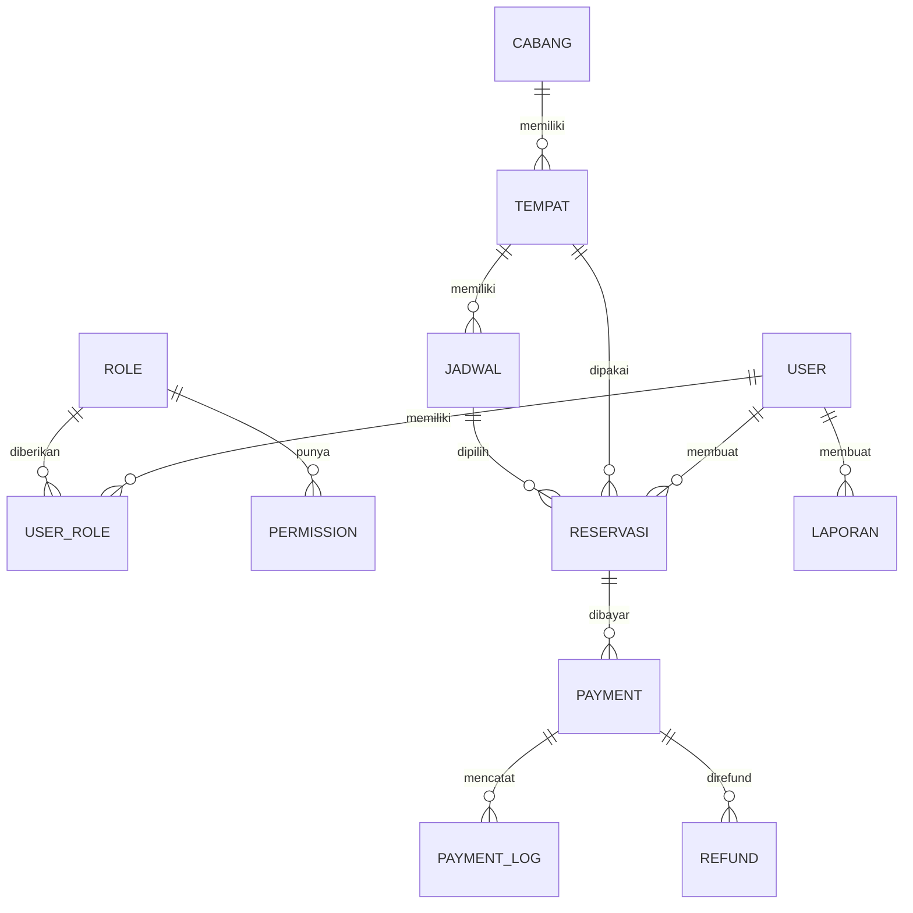

# Backend Technical Reference

Dokumen ini dibuat sebagai acuan teknis untuk perubahan kode backend. Isi di bawah berdasarkan kode yang ditemukan di folder `backend/` saat dokumen ini dibuat.

## 1. Ringkasan Backend

Backend ini menangani API reservasi SiBooking/IMPAL menggunakan FastAPI. Fitur yang ditemukan di kode mencakup autentikasi JWT, manajemen user dan akses berbasis role/permission, manajemen cabang dan tempat/meja, manajemen jadwal, reservasi dengan pengecekan slot aktif, pembayaran, log pembayaran, refund, laporan, ringkasan dashboard, dan generate PDF laporan sederhana.

## 2. Tech Stack Backend

- Framework: FastAPI
- ASGI server: Uvicorn
- ORM: SQLAlchemy 2.x
- Database target: PostgreSQL melalui `psycopg2-binary`
- Database test: SQLite in-memory pada unit test
- Validation/DTO: Pydantic v2
- Auth: JWT Bearer token dengan `python-jose`
- Password hashing: `bcrypt`; verifikasi legacy PBKDF2 dan plaintext masih didukung oleh `verify_password`
- Environment loader: `python-dotenv`
- Migration: dependency Alembic ada di `requirements.txt`, tetapi folder/config Alembic belum ditemukan di kode. SQL manual tersedia di `backend/sql/`.
- Test: `unittest`

## 3. Struktur Folder Backend

```text
backend/
|-- app/
|   |-- api/
|   |   |-- routes/
|   |   |-- deps.py
|   |   |-- router.py
|   |   |-- schemas.py
|   |   |-- Authentication.py
|   |   |-- KelolaCabangTempat.py
|   |   |-- KelolaJadwal.py
|   |   |-- Reservasi.py
|   |   |-- Pembayaran.py
|   |   `-- Laporan.py
|   |-- core/
|   |-- db/
|   |-- models/
|   |-- repositories/
|   |-- schemas/
|   |-- services/
|   `-- __init__.py
|-- sql/
|-- tests/
|-- .env.example
|-- Dockerfile
|-- main.py
|-- requirements.txt
`-- README.md
```

Fungsi folder/file penting:

- `main.py`: entry point ASGI, membuat `app` dari `app.create_app()`.
- `app/__init__.py`: factory FastAPI, konfigurasi CORS, healthcheck, dan registrasi router dengan prefix `/api`.
- `app/api/router.py`: menggabungkan semua router domain.
- `app/api/routes/`: endpoint aktif yang diregistrasikan ke aplikasi.
- `app/api/deps.py`: dependency database, JWT current user, dan permission guard.
- `app/api/*.py` dengan nama domain berhuruf besar: wrapper kompatibilitas yang hanya re-export router dari `app/api/routes/`.
- `app/core/config.py`: konfigurasi environment.
- `app/core/security.py`: password hashing, validasi password, JWT encode/decode.
- `app/db/session.py`: engine SQLAlchemy, `SessionLocal`, dan dependency `get_db`.
- `app/db/init_db.py`: membuat tabel via `Base.metadata.create_all`.
- `app/db/seed_dummy_data.py`: reset database dan insert dummy data development.
- `app/models/`: model ORM SQLAlchemy.
- `app/repositories/`: query database dan helper pagination/sort/filter.
- `app/schemas/`: schema Pydantic request/response.
- `app/services/`: business logic per domain.
- `sql/`: SQL manual untuk create table, data dummy, DFD, dan index.
- `tests/`: unit test service, auth/RBAC, reservasi, pagination, dan smoke OpenAPI/security.

## 4. Entry Point Aplikasi

- Entry point: `backend/main.py`
- App object: `app = create_app()`
- Factory aplikasi: `backend/app/__init__.py`
- Router utama: `api_router` dari `app/api/router.py`
- Prefix API utama: `/api`
- Healthcheck di luar prefix API:
  - `GET /`
  - `GET /health`
- Middleware:
  - `CORSMiddleware` ditemukan dan dipasang jika `settings.CORS_ORIGINS` tidak kosong.
- Router yang diregistrasikan:
  - `auth_router` dari `app/api/routes/auth.py`, prefix `/auth`
  - `master_data_router` dari `app/api/routes/master_data.py`, prefix `/master-data`
  - `jadwal_router` dari `app/api/routes/jadwal.py`, prefix `/jadwal`
  - `reservasi_router` dari `app/api/routes/reservasi.py`, prefix `/reservasi`
  - `pembayaran_router` dari `app/api/routes/pembayaran.py`, prefix `/pembayaran`
  - `laporan_router` dari `app/api/routes/laporan.py`, prefix `/laporan`

## 5. Konfigurasi Environment

| Variable | Fungsi | Digunakan di File |
|---|---|---|
| `APP_NAME` | Nama aplikasi FastAPI | `app/core/config.py`, `app/__init__.py` |
| `APP_ENV` | Memilih config development/production | `app/core/config.py` |
| `APP_DEBUG` | Mengatur debug FastAPI dan echo SQLAlchemy | `app/core/config.py`, `app/db/session.py` |
| `DATABASE_URL` | Override penuh koneksi database | `app/core/config.py` |
| `DB_HOST` | Host database jika `DATABASE_URL` kosong | `app/core/config.py` |
| `DB_PORT` | Port database jika `DATABASE_URL` kosong | `app/core/config.py` |
| `DB_NAME` | Nama database jika `DATABASE_URL` kosong | `app/core/config.py` |
| `DB_USER` | User database jika `DATABASE_URL` kosong | `app/core/config.py` |
| `DB_PASSWORD` | Password database jika `DATABASE_URL` kosong | `app/core/config.py` |
| `SECRET_KEY` | Secret JWT | `app/core/config.py`, `app/services/auth.py`, `app/api/deps.py` |
| `JWT_ALGORITHM` | Algoritma JWT | `app/core/config.py`, `app/services/auth.py`, `app/api/deps.py` |
| `ACCESS_TOKEN_EXPIRE_MINUTES` | Durasi token akses | `app/core/config.py`, `app/services/auth.py` |
| `SESSION_COOKIE_SECURE` | Flag secure untuk session cookie config | `app/core/config.py` |
| `MAIL_SERVER` | Konfigurasi mail server | `app/core/config.py` |
| `MAIL_PORT` | Port mail server | `app/core/config.py` |
| `MAIL_USE_TLS` | TLS mail server | `app/core/config.py` |
| `MAIL_USERNAME` | Username mail | `app/core/config.py` |
| `MAIL_PASSWORD` | Password mail | `app/core/config.py` |
| `MAIL_DEFAULT_SENDER` | Sender default mail | `app/core/config.py` |
| `FRONTEND_URL` | Origin CORS, diparse sebagai list dipisah koma | `app/core/config.py`, `app/__init__.py` |

Catatan: konfigurasi mail ditemukan, tetapi belum ditemukan service pengiriman email yang memakai setting tersebut.

## 6. Database dan ORM

- File konfigurasi database: `app/db/session.py`
- Engine: `create_engine(settings.database_url, echo=settings.app_debug)`
- Session: `SessionLocal = sessionmaker(autocommit=False, autoflush=False, bind=engine, class_=Session)`
- Dependency DB: `get_db()` yield session lalu close.
- Base model: `app/models/base.py` mendefinisikan `class Base(DeclarativeBase)`.
- Mekanisme pembuatan tabel:
  - `app/db/init_db.py` memanggil `Base.metadata.create_all(bind=engine)`.
  - App utama tidak otomatis memanggil `init_db()` saat startup.
- Migration:
  - `requirements.txt` mencantumkan Alembic.
  - Folder/config Alembic belum ditemukan di backend.
  - SQL manual ditemukan di `backend/sql/create_tables.sql` dan `backend/sql/20260513_add_api_performance_indexes.sql`.
- Seed/dummy data:
  - `backend/sql/dummy_data.sql` berisi insert data dummy SQL.
  - `app/db/seed_dummy_data.py` membuat ulang semua tabel dengan `drop_all` lalu `create_all`, kemudian insert dummy data. File ini berbahaya untuk production karena melakukan reset database.

## 7. Daftar Model Database

### User

File: `app/models/users.py`

Field:

- `id_user`
- `nama`
- `email`
- `password`
- `no_hp`

Relasi:

- User memiliki banyak `UserRole`.
- User memiliki banyak `Role` melalui tabel `user_roles`.
- User memiliki banyak `Reservasi`.
- User memiliki banyak `Laporan`.

Catatan logic:

- `email` unik dan digunakan untuk login.
- Password di-set dengan `User.set_password()`, yang memakai bcrypt.
- `User.verify_password()` memakai helper verifikasi yang juga mendukung hash legacy PBKDF2 dan plaintext.
- Index ditemukan pada `nama` dan `email`.

### Role

File: `app/models/roles.py`

Field:

- `id_role`
- `nama_role`

Relasi:

- Role memiliki banyak `UserRole`.
- Role memiliki banyak `User` melalui tabel `user_roles`.
- Role memiliki banyak `Permission`.

Catatan logic:

- `nama_role` unik.
- Constraint ORM membatasi role ke `user`, `admin`, dan `owner`.

### Permission

File: `app/models/permissions.py`

Field:

- `id_permission`
- `id_role`
- `nama_permission`

Relasi:

- Permission terhubung ke satu `Role`.

Catatan logic:

- `nama_permission` unik secara global.
- Method `get_permissions()` dan `list_permissions()` masih berisi `pass`; belum ada implementasi.
- Permission efektif user dihitung di `app/api/deps.py` sebagai gabungan permission tersimpan dan default role dari `app/services/permissions.py`.

### UserRole

File: `app/models/user_roles.py`

Field:

- `id_user`
- `id_role`

Relasi:

- UserRole terhubung ke satu `User`.
- UserRole terhubung ke satu `Role`.

Catatan logic:

- Primary key gabungan: `id_user`, `id_role`.
- Foreign key memakai `ondelete="CASCADE"`.

### Cabang

File: `app/models/cabang.py`

Field:

- `id_cabang`
- `nama`
- `lokasi`

Relasi:

- Cabang memiliki banyak `Tempat`.

Catatan logic:

- Menghapus cabang akan menghapus `Tempat` terkait melalui cascade ORM dan foreign key.
- Index ditemukan pada `nama`.

### Tempat

File: `app/models/tempat.py`

Field:

- `id_tempat`
- `id_cabang`
- `nomor_meja`
- `harga`
- `status`

Relasi:

- Tempat terhubung ke satu `Cabang`.
- Tempat memiliki banyak `Jadwal`.
- Tempat direferensikan oleh `Reservasi`.

Catatan logic:

- Foreign key `id_cabang` memakai cascade delete.
- Index ditemukan pada `id_cabang` dan `status`.
- Service list tempat hanya menerima filter status dari `available`, `occupied`, `maintenance`, `booked`, `unavailable`.
- Create/update tempat belum memvalidasi status terhadap daftar tersebut; hanya schema Pydantic yang memvalidasi panjang string.

### Jadwal

File: `app/models/jadwal.py`

Field:

- `id_jadwal`
- `id_tempat`
- `jam_mulai`
- `jam_selesai`

Relasi:

- Jadwal terhubung ke satu `Tempat`.
- Jadwal memiliki banyak `Reservasi`.

Catatan logic:

- Foreign key `id_tempat` memakai cascade delete.
- Index ditemukan pada `id_tempat` dan gabungan `id_tempat`, `jam_mulai`.
- Validasi `jam_selesai > jam_mulai` berada di schema `JadwalBase`.
- Belum ditemukan validasi bentrok jam antar jadwal pada tempat yang sama.

### Reservasi

File: `app/models/reservasi.py`

Field:

- `id_reservasi`
- `id_user`
- `id_tempat`
- `id_jadwal`
- `tanggal`
- `status`
- `total_harga`

Relasi:

- Reservasi terhubung ke satu `User`.
- Reservasi terhubung ke satu `Tempat`.
- Reservasi terhubung ke satu `Jadwal`.
- Reservasi memiliki banyak `Payment`.

Catatan logic:

- Partial unique index `uq_reservasi_active_slot` mencegah double booking untuk kombinasi `id_tempat`, `id_jadwal`, `tanggal` jika status `pending` atau `confirmed`.
- Service juga mengecek konflik slot aktif sebelum insert/update status.
- Status aktif yang memblokir slot didefinisikan di `app/repositories/reservasi.py`: `pending`, `confirmed`.
- Index ditemukan pada `status`, `tanggal`, `id_user`, `id_tempat`, dan `id_jadwal`.

### Payment

File: `app/models/payments.py`

Field:

- `id_payment`
- `id_reservasi`
- `amount`
- `status`

Relasi:

- Payment terhubung ke satu `Reservasi`.
- Payment memiliki banyak `PaymentLog`.
- Payment memiliki banyak `Refund`.

Catatan logic:

- Foreign key `id_reservasi` memakai cascade delete.
- Index ditemukan pada `status` dan `id_reservasi`.
- Belum ditemukan sinkronisasi otomatis dari status pembayaran ke status reservasi.

### PaymentLog

File: `app/models/payment_logs.py`

Field:

- `id_log`
- `id_payment`
- `response`

Relasi:

- PaymentLog terhubung ke satu `Payment`.

Catatan logic:

- Menyimpan response gateway/manual sebagai text.
- Belum ditemukan parser/validator khusus untuk format `response`.

### Refund

File: `app/models/refunds.py`

Field:

- `id_refund`
- `id_payment`
- `amount`
- `status`

Relasi:

- Refund terhubung ke satu `Payment`.

Catatan logic:

- Foreign key `id_payment` memakai cascade delete.
- Belum ditemukan validasi agar `amount` refund tidak melebihi amount payment.

### Laporan

File: `app/models/laporan.py`

Field:

- `id_laporan`
- `tipe`
- `lampiran`
- `dibuat_oleh`

Relasi:

- Laporan terhubung ke satu `User` melalui `dibuat_oleh`.

Catatan logic:

- Index ditemukan pada `tipe` dan `dibuat_oleh`.
- PDF laporan dibuat secara manual di service `laporan`, bukan memakai library PDF eksternal.

## 8. Relasi Antar Model

- User memiliki banyak Reservasi.
- User memiliki banyak Laporan.
- User memiliki banyak Role melalui UserRole.
- Role memiliki banyak Permission.
- Cabang memiliki banyak Tempat.
- Tempat memiliki banyak Jadwal.
- Tempat dapat dipakai banyak Reservasi.
- Jadwal dapat dipakai banyak Reservasi.
- Reservasi terhubung ke User, Tempat, dan Jadwal.
- Reservasi memiliki banyak Payment.
- Payment memiliki banyak PaymentLog.
- Payment memiliki banyak Refund.



## 9. Schema / DTO / Serializer

| Schema | File | Field | Digunakan untuk |
|---|---|---|---|
| `UserCreate` | `app/schemas/auth.py` | `nama`, `email`, `password`, `no_hp` | `POST /api/auth/register` |
| `LoginRequest` | `app/schemas/auth.py` | `email`, `password` | `POST /api/auth/login` |
| `LogoutResponse` | `app/schemas/auth.py` | `message` | `POST /api/auth/logout` |
| `UserRead` | `app/schemas/auth.py` | `id_user`, `nama`, `email`, `no_hp` | Response auth dan nested response reservasi |
| `UserUpdate` | `app/schemas/auth.py` | `nama`, `email`, `no_hp`, `roles?` | `PATCH /api/auth/users/{user_id}` |
| `UserAccessRead` | `app/schemas/auth.py` | `id_user`, `nama`, `email`, `no_hp`, `roles`, `permissions`, `status` | `GET /api/auth/users`, `PATCH /api/auth/users/{user_id}` |
| `AuthResponse` | `app/schemas/auth.py` | `user`, `roles`, `permissions`, `token`, `access_token`, `token_type`, `expires_at`, `expires_in`, `message` | register, login, me, user access |
| `RoleRead` | `app/schemas/auth.py` | `id_role`, `nama_role` | Schema ditemukan, belum ditemukan endpoint aktif yang memakai langsung |
| `PermissionRead` | `app/schemas/auth.py` | `id_permission`, `id_role`, `nama_permission` | Schema ditemukan, belum ditemukan endpoint aktif yang memakai langsung |
| `CabangCreate` | `app/schemas/master_data.py` | `nama`, `lokasi` | `POST /api/master-data/cabang` |
| `CabangUpdate` | `app/schemas/master_data.py` | `nama`, `lokasi` | `PATCH /api/master-data/cabang/{cabang_id}` |
| `CabangRead` | `app/schemas/master_data.py` | `id_cabang`, `nama`, `lokasi` | Response cabang dan nested tempat |
| `TempatCreate` | `app/schemas/master_data.py` | `id_cabang`, `nomor_meja`, `harga`, `status` | `POST /api/master-data/tempat` |
| `TempatUpdate` | `app/schemas/master_data.py` | `id_cabang`, `nomor_meja`, `harga`, `status` | `PATCH /api/master-data/tempat/{tempat_id}` |
| `TempatRead` | `app/schemas/master_data.py` | `id_tempat`, `id_cabang`, `nomor_meja`, `harga`, `status`, `cabang` | Response tempat dan nested reservasi |
| `JadwalCreate` | `app/schemas/jadwal.py` | `id_tempat`, `jam_mulai`, `jam_selesai` | `POST /api/jadwal/` |
| `JadwalUpdate` | `app/schemas/jadwal.py` | `id_tempat`, `jam_mulai`, `jam_selesai` | `PATCH /api/jadwal/{jadwal_id}` |
| `JadwalRead` | `app/schemas/jadwal.py` | `id_jadwal`, `id_tempat`, `jam_mulai`, `jam_selesai` | Response jadwal dan nested reservasi |
| `JadwalAvailabilityRead` | `app/schemas/jadwal.py` | field `JadwalRead` + `available` | `GET /api/jadwal/availability` |
| `ReservasiCreate` | `app/schemas/reservasi.py` | `id_user`, `id_tempat`, `id_jadwal`, `tanggal`, `status`, `total_harga` | `POST /api/reservasi/` |
| `ReservasiUpdateStatus` | `app/schemas/reservasi.py` | `status` | `PATCH /api/reservasi/{reservasi_id}/status` |
| `ReservasiRead` | `app/schemas/reservasi.py` | `id_reservasi`, `id_user`, `id_tempat`, `id_jadwal`, `tanggal`, `status`, `total_harga`, `user`, `tempat`, `jadwal` | Response reservasi dan nested payment |
| `PaymentCreate` | `app/schemas/pembayaran.py` | `id_reservasi`, `amount`, `status` | `POST /api/pembayaran/` |
| `PaymentUpdateStatus` | `app/schemas/pembayaran.py` | `status` | `PATCH /api/pembayaran/{payment_id}/status` |
| `PaymentRead` | `app/schemas/pembayaran.py` | `id_payment`, `id_reservasi`, `amount`, `status`, `reservasi` | Response pembayaran |
| `PaymentLogCreate` | `app/schemas/pembayaran.py` | `response` | `POST /api/pembayaran/{payment_id}/logs` |
| `PaymentLogRead` | `app/schemas/pembayaran.py` | `id_log`, `id_payment`, `response` | Response log pembayaran |
| `RefundCreate` | `app/schemas/pembayaran.py` | `amount`, `status` | `POST /api/pembayaran/{payment_id}/refunds` |
| `RefundUpdateStatus` | `app/schemas/pembayaran.py` | `status` | `PATCH /api/pembayaran/refunds/{refund_id}/status` |
| `RefundRead` | `app/schemas/pembayaran.py` | `id_refund`, `id_payment`, `amount`, `status` | Response refund |
| `LaporanCreate` | `app/schemas/laporan.py` | `tipe`, `lampiran`, `dibuat_oleh` | `POST /api/laporan/`; route mengganti `dibuat_oleh` dengan current user |
| `LaporanUpdate` | `app/schemas/laporan.py` | `tipe`, `lampiran`, `dibuat_oleh` | `PATCH /api/laporan/{laporan_id}` |
| `LaporanRead` | `app/schemas/laporan.py` | `id_laporan`, `tipe`, `lampiran`, `dibuat_oleh` | Response laporan |
| `DashboardSummaryRead` | `app/schemas/laporan.py` | `total_bookings`, `active_bookings`, `paid_payments`, `pending_payments`, `income_total` | `GET /api/laporan/summary` |
| `PaginatedResponse[T]` | `app/schemas/common.py` | `data`, `pagination` | Semua endpoint list utama |
| `PaginationMeta` | `app/schemas/common.py` | `page`, `limit`, `total_items`, `total_pages`, `has_next`, `has_prev` | Metadata pagination |
| `ErrorResponse` | `app/schemas/common.py` | `detail` | Dokumentasi OpenAPI error umum |

## 10. Router dan Endpoint API

| Method | Endpoint | Router/File | Fungsi | Auth/Role |
|---|---|---|---|---|
| GET | `/` | `app/__init__.py` | Health message API | Public |
| GET | `/health` | `app/__init__.py` | Healthcheck container/proxy | Public |
| POST | `/api/auth/register` | `app/api/routes/auth.py` | Register user, hash password, beri role default user jika role ada | Public |
| POST | `/api/auth/login` | `app/api/routes/auth.py` | Login dan issue JWT | Public |
| POST | `/api/auth/logout` | `app/api/routes/auth.py` | Logout stateless | JWT valid |
| GET | `/api/auth/me` | `app/api/routes/auth.py` | Ambil akses user login | JWT valid |
| GET | `/api/auth/users` | `app/api/routes/auth.py` | List users dengan role/permission | Role `admin` dan bukan `owner` berdasarkan `_can_manage_users` |
| GET | `/api/auth/users/{user_id}/access` | `app/api/routes/auth.py` | Lihat akses user | User sendiri atau role `admin` dan bukan `owner` |
| PATCH | `/api/auth/users/{user_id}` | `app/api/routes/auth.py` | Update profil user dan role user lain | Profil: user sendiri atau role `admin` dan bukan `owner`; perubahan role: hanya admin untuk user lain |
| DELETE | `/api/auth/users/{user_id}` | `app/api/routes/auth.py` | Hapus user | Role `admin` dan bukan `owner` |
| GET | `/api/auth/permissions` | `app/api/routes/auth.py` | List nama permission | `manage_roles` |
| GET | `/api/master-data/cabang` | `app/api/routes/master_data.py` | List cabang, pagination/search/sort | `view_locations` atau `manage_branches` atau `manage_tables` |
| POST | `/api/master-data/cabang` | `app/api/routes/master_data.py` | Buat cabang | `manage_branches` |
| PATCH | `/api/master-data/cabang/{cabang_id}` | `app/api/routes/master_data.py` | Update cabang | `manage_branches` |
| DELETE | `/api/master-data/cabang/{cabang_id}` | `app/api/routes/master_data.py` | Hapus cabang | `manage_branches` |
| GET | `/api/master-data/tempat` | `app/api/routes/master_data.py` | List tempat, filter cabang/status, pagination/search/sort | `view_locations` atau `manage_branches` atau `manage_tables` |
| POST | `/api/master-data/tempat` | `app/api/routes/master_data.py` | Buat tempat | `manage_tables` |
| PATCH | `/api/master-data/tempat/{tempat_id}` | `app/api/routes/master_data.py` | Update tempat | `manage_tables` |
| DELETE | `/api/master-data/tempat/{tempat_id}` | `app/api/routes/master_data.py` | Hapus tempat | `manage_tables` |
| GET | `/api/jadwal/` | `app/api/routes/jadwal.py` | List jadwal, filter tempat/cabang/jam, pagination/sort | `view_schedules` atau `manage_schedules` |
| GET | `/api/jadwal/availability` | `app/api/routes/jadwal.py` | List jadwal untuk tempat/tanggal dengan flag available | `view_schedules` atau `manage_schedules` |
| GET | `/api/jadwal/tersedia` | `app/api/routes/jadwal.py` | List jadwal yang tempatnya `available` | `view_schedules` atau `manage_schedules` |
| POST | `/api/jadwal/` | `app/api/routes/jadwal.py` | Buat jadwal | `manage_schedules` |
| PATCH | `/api/jadwal/{jadwal_id}` | `app/api/routes/jadwal.py` | Update jadwal | `manage_schedules` |
| DELETE | `/api/jadwal/{jadwal_id}` | `app/api/routes/jadwal.py` | Hapus jadwal | `manage_schedules` |
| GET | `/api/reservasi/` | `app/api/routes/reservasi.py` | List reservasi; user biasa hanya miliknya sendiri | `view_reservations` atau `manage_reservations` |
| POST | `/api/reservasi/` | `app/api/routes/reservasi.py` | Buat reservasi | `create_reservations` atau `manage_reservations` |
| PATCH | `/api/reservasi/{reservasi_id}/status` | `app/api/routes/reservasi.py` | Update status reservasi | `manage_reservations` |
| GET | `/api/pembayaran/` | `app/api/routes/pembayaran.py` | List pembayaran; user biasa hanya miliknya sendiri | `view_payments` atau `manage_payments` |
| POST | `/api/pembayaran/` | `app/api/routes/pembayaran.py` | Buat pembayaran | `create_payments` atau `manage_payments` |
| PATCH | `/api/pembayaran/{payment_id}/status` | `app/api/routes/pembayaran.py` | Update status pembayaran | `manage_payments` |
| POST | `/api/pembayaran/{payment_id}/logs` | `app/api/routes/pembayaran.py` | Simpan log response pembayaran | `manage_payments` |
| POST | `/api/pembayaran/{payment_id}/refunds` | `app/api/routes/pembayaran.py` | Buat request refund | `request_refunds` atau `manage_payments` |
| PATCH | `/api/pembayaran/refunds/{refund_id}/status` | `app/api/routes/pembayaran.py` | Update status refund | `approve_refunds` atau `manage_payments` |
| GET | `/api/laporan/` | `app/api/routes/laporan.py` | List laporan, pagination/search/filter/sort | `view_reports` atau `manage_reports` |
| GET | `/api/laporan/summary` | `app/api/routes/laporan.py` | Ringkasan dashboard booking/payment/income | `view_reports` atau `manage_reports` |
| POST | `/api/laporan/` | `app/api/routes/laporan.py` | Buat metadata laporan | `manage_reports` |
| PATCH | `/api/laporan/{laporan_id}` | `app/api/routes/laporan.py` | Update metadata laporan | `manage_reports` |
| GET | `/api/laporan/{laporan_id}/pdf` | `app/api/routes/laporan.py` | Generate/download PDF laporan | `view_reports` atau `manage_reports` |

## 11. Business Logic Penting

### Auth, JWT, dan Password

File:

- `app/services/auth.py`
- `app/api/deps.py`
- `app/core/security.py`

Fungsi:

- `register_user()`
- `login_user()`
- `build_auth_response()`
- `get_current_user()`
- `create_access_token()`
- `decode_access_token()`
- `hash_password()`
- `verify_password()`

Cara kerja:

- Register mengecek email duplikat, membuat user, hash password bcrypt, lalu menambahkan role default `user` jika role tersebut ada.
- Login mencari user berdasarkan email dan memverifikasi password.
- Token JWT memakai `sub` berisi `id_user`, plus claim `email`, `roles`, dan `permissions`.
- `get_current_user()` membaca Bearer token, decode JWT, validasi subject, lalu mengambil user dari database.

Catatan penting:

- Jangan ubah isi claim token tanpa mengecek frontend/client yang membaca `access_token`, `token`, `roles`, dan `permissions`.
- Jika role `user` belum ada di database, register tetap membuat user tetapi tanpa role default.
- `logout_user()` stateless; token tidak di-blacklist di backend.

### Role-Based Access dan Permission

File:

- `app/api/deps.py`
- `app/services/permissions.py`
- `app/api/routes/auth.py`

Fungsi:

- `get_user_permissions()`
- `has_permission()`
- `has_any_permission()`
- `require_permissions()`
- `require_admin_user_manager()`

Cara kerja:

- Permission efektif adalah gabungan permission tersimpan di tabel `permissions` dan default permission dari `ROLE_PERMISSION_DEFAULTS`.
- `require_permissions()` mengizinkan akses jika user punya minimal satu permission yang diminta.
- Manajemen user di route auth memakai helper khusus `_can_manage_users()`, yaitu role `admin` dan bukan `owner`.

Catatan penting:

- Jangan asumsikan `MANAGE_USERS` otomatis dipakai untuk endpoint `/api/auth/users`; kode aktif memakai role name `admin`.
- Owner default hanya punya akses laporan berdasarkan `ROLE_PERMISSION_DEFAULTS`; akses lain perlu permission tersimpan atau perubahan mapping.

### Pagination, Search, Sort, dan Filter

File:

- `app/repositories/query_helpers.py`

Fungsi:

- `build_paginated_response()`
- `paginate_scalars()`
- `apply_sort()`
- `validate_value()`
- `normalize_search()`

Cara kerja:

- Endpoint list utama memakai envelope `{"data": [...], "pagination": {...}}`.
- `page` minimal 1, `limit` minimal 1 maksimal 100 pada router.
- `apply_sort()` menolak `sort_by` di luar allowlist dengan HTTP 400.
- `validate_value()` menormalisasi filter status ke lowercase dan menolak value di luar daftar.

Catatan penting:

- Jangan mengubah response pagination tanpa menandai endpoint terdampak.
- Jika menambah sort/filter, update allowlist repository dan dokumentasi endpoint.

### Manajemen Cabang dan Tempat

File:

- `app/services/master_data.py`
- `app/repositories/master_data.py`

Fungsi:

- `list_cabang()`
- `create_cabang()`
- `update_cabang()`
- `delete_cabang()`
- `list_tempat()`
- `create_tempat()`
- `update_tempat()`
- `delete_tempat()`

Cara kerja:

- Cabang dan tempat dilist dengan pagination.
- Tempat bisa difilter `id_cabang`, `status_tempat`, dan search `nomor_meja`.
- Create/update tempat mengecek cabang tujuan ada.
- Delete cabang menghapus tempat terkait karena cascade.

Catatan penting:

- Status tempat pada create/update belum dibatasi ke daftar `TEMPAT_STATUSES`; kalau ingin membatasi, cek dampak ke data existing.
- Menghapus cabang/tempat bisa menghapus jadwal/reservasi terkait lewat cascade relasi dan foreign key.

### Jadwal dan Availability

File:

- `app/services/jadwal.py`
- `app/repositories/jadwal.py`
- `app/repositories/reservasi.py`

Fungsi:

- `list_jadwal()`
- `list_jadwal_tersedia()`
- `list_jadwal_availability()`
- `checkAvailability()`
- `create_jadwal()`
- `update_jadwal()`
- `delete_jadwal()`

Cara kerja:

- Jadwal dibuat untuk tempat yang sudah ada.
- Schema memastikan `jam_selesai` lebih besar dari `jam_mulai`.
- Availability mengambil jadwal untuk satu tempat dan tanggal, lalu menandai `available=False` jika ada reservasi aktif pada jadwal tersebut.
- Reservasi aktif yang memblokir availability adalah `pending` dan `confirmed`.
- `list_jadwal_tersedia()` hanya melihat status tempat `available`, bukan konflik reservasi pada tanggal tertentu.

Catatan penting:

- Jangan samakan `GET /api/jadwal/tersedia` dengan availability per tanggal.
- Belum ditemukan validasi overlap jam jadwal pada tempat yang sama.

### Reservasi dan Double Booking

File:

- `app/services/reservasi.py`
- `app/repositories/reservasi.py`
- `app/models/reservasi.py`

Fungsi:

- `create_reservasi()`
- `update_status_reservasi()`
- `_assert_tanggal_not_past()`
- `_assert_slot_available()`
- `get_active_slot_conflict()`

Cara kerja:

- User biasa hanya boleh membuat reservasi untuk dirinya sendiri.
- Tanggal reservasi tidak boleh di masa lalu.
- Service mengecek user, tempat, dan jadwal ada.
- Service memastikan `jadwal.id_tempat` sama dengan `payload.id_tempat`.
- Jika status reservasi adalah `pending` atau `confirmed`, service mengecek konflik slot pada `id_tempat`, `id_jadwal`, dan `tanggal`.
- Database juga memiliki partial unique index untuk slot aktif `pending` atau `confirmed`.
- Status `cancelled`, `completed`, `declined`, `no_show`, `expired`, dan `refunded` tidak memblokir slot berdasarkan kode conflict saat ini.

Catatan penting:

- Jangan sampai status `cancelled` kembali memblokir booking baru kecuali aturan bisnis memang diubah.
- Create/update status belum menolak status arbitrary; daftar status hanya dipakai untuk filter list.
- Jika menambah status aktif baru, update `ACTIVE_RESERVATION_STATUSES`, partial unique index, SQL migration, dan test availability/double booking.

### Pembayaran, Log Pembayaran, dan Refund

File:

- `app/services/pembayaran.py`
- `app/repositories/pembayaran.py`

Fungsi:

- `list_pembayaran()`
- `create_pembayaran()`
- `update_status_pembayaran()`
- `create_payment_log()`
- `create_refund()`
- `update_status_refund()`
- `_assert_reservasi_access()`
- `_assert_payment_access()`

Cara kerja:

- User biasa hanya bisa melihat/membuat pembayaran untuk reservasi miliknya.
- User dengan `manage_payments` bisa melihat/mengelola semua pembayaran.
- Status filter pembayaran divalidasi terhadap `pending`, `paid`, `unpaid`, `failed`, `refunded`, `void`, `expired`.
- Payment log hanya menyimpan field text `response`.
- Refund dibuat untuk payment yang ada dan dicek kepemilikannya untuk user biasa.

Catatan penting:

- Belum ditemukan integrasi gateway pembayaran aktual; yang ada hanya penyimpanan log response.
- Update status pembayaran/refund belum memvalidasi status terhadap allowlist kecuali pada filter list.
- Belum ditemukan validasi amount refund terhadap amount payment.
- Belum ditemukan perubahan otomatis status reservasi saat payment menjadi `paid` atau `refunded`.

### Laporan, Dashboard, dan PDF

File:

- `app/api/routes/laporan.py`
- `app/services/laporan.py`
- `app/repositories/laporan.py`

Fungsi:

- `list_laporan()`
- `get_dashboard_summary()`
- `create_laporan()`
- `update_laporan()`
- `generate_laporan_pdf()`
- `_build_report_lines()`
- `_build_pdf()`

Cara kerja:

- List laporan memakai pagination, search, filter `tipe`, filter `dibuat_oleh`, dan sort.
- Dashboard summary menghitung total booking, active booking, paid payment, pending payment, dan total income paid.
- Filter summary tersedia untuk `id_cabang`, `start_date`, dan `end_date`.
- Route create laporan mengabaikan `dibuat_oleh` dari payload dan memakai `current_user.id_user`.
- Generate PDF mengambil data terbaru dari database lalu membangun PDF sederhana secara manual.

Catatan penting:

- Jangan pindahkan logic summary tanpa mempertahankan filter cabang dan tanggal.
- PDF generator custom perlu dites jika menambah teks panjang, karakter non-Latin, atau layout baru.

## 12. Hak Akses dan Role

Role yang ditemukan:

| Role | Hak Akses Berdasarkan Kode |
|---|---|
| `user` | Default: `view_locations`, `view_schedules`, `create_reservations`, `view_reservations`, `create_payments`, `view_payments`, `request_refunds` |
| `admin` | Default: `manage_users`, `view_reports`, `manage_branches`, `manage_tables`, `manage_schedules`, `manage_reservations`, `manage_payments` |
| `owner` | Default: `view_reports`, `manage_reports` |

Cara role disimpan:

- Tabel `roles` menyimpan role.
- Tabel `user_roles` menjadi pivot many-to-many user dan role.
- Tabel `permissions` menyimpan permission per role.
- Permission efektif = permission dari tabel + default mapping `ROLE_PERMISSION_DEFAULTS`.

Cara permission dicek:

- Dependency `get_current_user()` membaca JWT dan mengambil user.
- Dependency `require_permissions(*permissions)` mengecek minimal satu permission.
- Helper `has_permission()` dipakai service untuk scoping data user biasa vs admin/manager.

Endpoint yang dibatasi role/permission:

- Mayoritas endpoint memakai `require_permissions()`.
- Endpoint manajemen user memakai `require_admin_user_manager()`, yaitu role `admin` dan bukan `owner`, bukan langsung `manage_users`.
- Endpoint user access/update memperbolehkan user mengakses dirinya sendiri.

Catatan:

- Mapping role default ditemukan di `app/services/permissions.py`.
- Permission tersimpan di database juga dihitung, sehingga perubahan data permission dapat memengaruhi akses tanpa mengubah kode.

## 13. Alur Utama Sistem

### Alur Register

1. Client mengirim `POST /api/auth/register`.
2. `auth_service.register_user()` mengecek email duplikat.
3. Password di-hash dengan bcrypt.
4. Role default `user` ditambahkan jika role tersebut tersedia.
5. Backend mengembalikan `AuthResponse` dengan JWT.

Endpoint/fungsi terkait:

- `POST /api/auth/register`
- `register_user()`
- `User.set_password()`
- `build_auth_response()`

### Alur Login

1. Client mengirim `POST /api/auth/login`.
2. Backend mencari user berdasarkan email.
3. Password diverifikasi.
4. Backend membuat JWT dan mengembalikan role serta permission.

Endpoint/fungsi terkait:

- `POST /api/auth/login`
- `login_user()`
- `validate_user_password()`
- `build_auth_response()`

### Alur Ambil Daftar Cabang

1. Client login dengan permission yang sesuai.
2. Client memanggil `GET /api/master-data/cabang`.
3. Backend mengembalikan data cabang dalam format pagination.

Endpoint/fungsi terkait:

- `GET /api/master-data/cabang`
- `master_data.list_cabang()`
- `repositories.master_data.list_cabang()`

### Alur Ambil Tempat Berdasarkan Cabang

1. Client memanggil `GET /api/master-data/tempat?id_cabang=...`.
2. Backend memfilter tempat berdasarkan cabang.
3. Optional filter status tersedia via `status_tempat`.

Endpoint/fungsi terkait:

- `GET /api/master-data/tempat`
- `master_data.list_tempat()`

### Alur Ambil Jadwal / Availability

1. Client memilih tempat dan tanggal.
2. Client memanggil `GET /api/jadwal/availability?id_tempat=...&tanggal=...`.
3. Backend mengambil jadwal tempat tersebut.
4. Backend mengambil reservasi aktif pada tanggal yang sama.
5. Backend memberi flag `available` per jadwal.

Endpoint/fungsi terkait:

- `GET /api/jadwal/availability`
- `jadwal.list_jadwal_availability()`
- `reservasi_repo.list_active_jadwal_ids_for_tempat_tanggal()`

### Alur Membuat Reservasi

1. User memilih tempat, jadwal, dan tanggal.
2. Client mengirim `POST /api/reservasi/`.
3. Backend mengecek user hanya booking untuk dirinya sendiri kecuali punya `manage_reservations`.
4. Backend mengecek tanggal bukan masa lalu.
5. Backend mengecek user, tempat, jadwal, dan kecocokan jadwal-tempat.
6. Backend mengecek konflik slot aktif jika status `pending` atau `confirmed`.
7. Backend membuat reservasi.

Endpoint/fungsi terkait:

- `POST /api/reservasi/`
- `reservasi.create_reservasi()`
- `reservasi_repo.get_active_slot_conflict()`

### Alur Pembayaran

1. Client mengirim `POST /api/pembayaran/` dengan `id_reservasi`.
2. Backend mengecek reservasi ada.
3. User biasa hanya boleh membuat pembayaran untuk reservasinya sendiri.
4. Backend membuat row `Payment`.
5. Admin/manager bisa mengubah status pembayaran via endpoint status.
6. Log gateway/manual dapat disimpan via endpoint logs.

Endpoint/fungsi terkait:

- `POST /api/pembayaran/`
- `PATCH /api/pembayaran/{payment_id}/status`
- `POST /api/pembayaran/{payment_id}/logs`
- `pembayaran.create_pembayaran()`
- `pembayaran.update_status_pembayaran()`
- `pembayaran.create_payment_log()`

### Alur Update Status Reservasi

1. Admin/manager memanggil `PATCH /api/reservasi/{reservasi_id}/status`.
2. Jika status baru aktif (`pending` atau `confirmed`), backend mengecek konflik slot dengan mengecualikan reservasi saat ini.
3. Backend menyimpan status baru.

Endpoint/fungsi terkait:

- `PATCH /api/reservasi/{reservasi_id}/status`
- `reservasi.update_status_reservasi()`

### Alur Refund

1. User atau admin membuat refund via `POST /api/pembayaran/{payment_id}/refunds`.
2. User biasa hanya boleh refund payment miliknya sendiri.
3. Admin/owner yang punya permission terkait mengubah status refund via `PATCH /api/pembayaran/refunds/{refund_id}/status`.

Endpoint/fungsi terkait:

- `POST /api/pembayaran/{payment_id}/refunds`
- `PATCH /api/pembayaran/refunds/{refund_id}/status`
- `pembayaran.create_refund()`
- `pembayaran.update_status_refund()`

### Alur Generate Laporan

1. User dengan `manage_reports` membuat metadata laporan via `POST /api/laporan/`.
2. User dengan `view_reports` atau `manage_reports` dapat melihat list laporan.
3. User dapat mengambil summary dashboard via `GET /api/laporan/summary`.
4. User dapat generate/download PDF via `GET /api/laporan/{laporan_id}/pdf`.

Endpoint/fungsi terkait:

- `POST /api/laporan/`
- `GET /api/laporan/`
- `GET /api/laporan/summary`
- `GET /api/laporan/{laporan_id}/pdf`
- `laporan.generate_laporan_pdf()`

## 14. Validasi dan Error Handling

Bentuk validasi request:

- Pydantic `Field` untuk panjang string, angka `ge=0`, dan tipe data.
- `JadwalBase` memakai `model_validator` untuk memastikan `jam_selesai > jam_mulai`.
- Query `page` dan `limit` divalidasi pada router.
- Filter status tertentu divalidasi di service melalui `validate_value()`.
- JWT divalidasi di dependency `get_current_user()`.

Bentuk error response umum:

- HTTPException biasanya mengembalikan `{"detail": "..."}`.
- Error validasi Pydantic/FastAPI memakai format default 422.
- `COMMON_ERROR_RESPONSES` mendokumentasikan 400, 401, 403, 404, 409, dan 422 untuk OpenAPI.

| Status Code | Kondisi Berdasarkan Kode |
|---|---|
| 400 | Request/filter/sort tidak valid, tanggal reservasi masa lalu, jadwal tidak sesuai tempat |
| 401 | Token tidak dikirim, token expired, token invalid, subject token invalid, user token tidak ditemukan |
| 403 | Permission tidak cukup, user mencoba mengakses data user/reservasi/payment milik orang lain |
| 404 | User/cabang/tempat/jadwal/reservasi/payment/refund/laporan tidak ditemukan |
| 409 | Email sudah terdaftar, slot jadwal sudah dipesan |
| 422 | Validasi schema/query FastAPI/Pydantic gagal |

## 15. Catatan Optimasi API

| Endpoint | Potensi Masalah | Rekomendasi |
|---|---|---|
| `GET /api/auth/users` | Join role/permission dapat berat jika data user besar | Pagination sudah ada; pertahankan `limit <= 100`, tambah filter/index jika query role makin sering |
| `GET /api/master-data/cabang` | Search `ilike` pada nama/lokasi bisa berat | Index nama sudah ada; pertimbangkan index lokasi atau full-text search jika data besar |
| `GET /api/master-data/tempat` | Response dapat membawa cabang nested; filter tanpa cabang bisa mengambil semua tempat | Pagination sudah ada; sarankan frontend memakai `id_cabang` saat konteks cabang tersedia |
| `GET /api/jadwal/` | Filter cabang melakukan join ke tempat | Index `jadwal.id_tempat` dan `tempat.id_cabang` sudah ada; pertahankan filter spesifik |
| `GET /api/jadwal/availability` | Mengecek availability per tempat/tanggal dengan dua query | Cukup untuk data kecil; jika slot sangat banyak, pertimbangkan join/subquery untuk flag availability |
| `GET /api/reservasi/` | Query join user/tempat/jadwal untuk search/sort dan response nested | Pagination dan `selectinload` sudah ada; pastikan index tanggal/status/user/tempat/jadwal tetap ada |
| `GET /api/pembayaran/` | Response nested reservasi, user, tempat, cabang, jadwal dapat besar | Pagination dan `selectinload` sudah ada; pertimbangkan response ringkas untuk dashboard/list besar |
| `GET /api/laporan/summary` | Menjalankan beberapa query agregasi terpisah | Untuk data besar, pertimbangkan satu query agregasi atau materialized summary |
| `GET /api/laporan/{laporan_id}/pdf` | Menghitung agregasi global dan recent reservations saat request PDF | Pertimbangkan cache/snapshot laporan jika PDF sering diunduh |
| `POST /api/pembayaran/{payment_id}/logs` | Belum ada endpoint list, tetapi tabel log bisa membesar | Jika nanti ditambah list log, wajib pagination dan filter payment/date |

Catatan indeks:

- `backend/sql/20260513_add_api_performance_indexes.sql` menambahkan index untuk reservasi, tempat, jadwal, payments, cabang, users, dan laporan.
- Model ORM juga mendefinisikan beberapa index yang sama.
- Pastikan SQL manual dan model ORM tetap sinkron jika schema berubah.

## 16. Catatan untuk Perubahan Kode Selanjutnya

- Jangan mengubah kontrak API tanpa menjelaskan endpoint terdampak dan dampak ke frontend.
- Jangan mengubah nama field model tanpa migration dan update schema Pydantic.
- Jangan mengubah logic auth/JWT tanpa mengecek `get_current_user()`, `build_auth_response()`, role, dan permission.
- Jangan mengubah mapping role default tanpa mengecek endpoint yang memakai `require_permissions()`.
- Jangan lupa bahwa endpoint user management memakai role `admin` khusus, bukan permission `manage_users` secara langsung.
- Jangan menghapus filter status pada reservasi/payment.
- Jangan mengubah `ACTIVE_RESERVATION_STATUSES` tanpa migration partial unique index dan test double booking.
- Jangan membuat endpoint list baru tanpa pagination.
- Jika menambahkan pagination ke endpoint lama, jelaskan format response baru.
- Jika mengubah response API, tuliskan endpoint terdampak dan perubahan frontend yang diperlukan.
- Jika mengubah database schema, buat catatan migration SQL/Alembic dan update `sql/create_tables.sql` jika file itu masih menjadi referensi.
- Jika mengubah delete cabang/tempat/jadwal, cek dampak cascade ke reservasi, payment, refund, dan laporan.
- Jika mengubah logic payment/refund, cek apakah perlu sinkronisasi status reservasi.
- Jangan mengimplementasikan payment gateway nyata karena payment saat ini hanya digunakan sebagai simulasi alur.
- Jangan mengubah alur payment menjadi integrasi eksternal tanpa persetujuan.
- Fokuskan payment pada pencatatan status, log response simulasi, dan keterkaitan internal dengan reservasi.
- Jika ada logic bisnis ambigu, minta konfirmasi terlebih dahulu sebelum mengubah aturan.
- Jangan menjalankan `app/db/seed_dummy_data.py` di production karena script tersebut melakukan `drop_all`.

## 17. Area yang Perlu Dicek Manual

- Alembic ada di dependency, tetapi folder/config migration Alembic belum ditemukan.
- `Permission.get_permissions()` dan `Permission.list_permissions()` masih `pass`.
- Status create/update untuk reservasi, payment, refund, dan tempat belum semuanya divalidasi terhadap allowlist; filter list sudah divalidasi pada beberapa service.
- Belum ditemukan validasi overlap jam jadwal pada tempat yang sama.
- Belum ditemukan validasi amount refund tidak melebihi amount payment.
- Belum ditemukan integrasi payment gateway aktual; backend hanya menyimpan payment, status, dan log response.
- Belum ditemukan sinkronisasi otomatis antara status pembayaran dan status reservasi.
- Konfigurasi mail ditemukan, tetapi service pengiriman email belum ditemukan.
- `seed_dummy_data.py` melakukan reset database penuh; perlu dipastikan hanya dipakai untuk development.
- Owner default hanya mengelola laporan; jika owner diharapkan punya akses penuh, mapping role perlu dikonfirmasi.
- Endpoint delete laporan belum ditemukan di router aktif.
